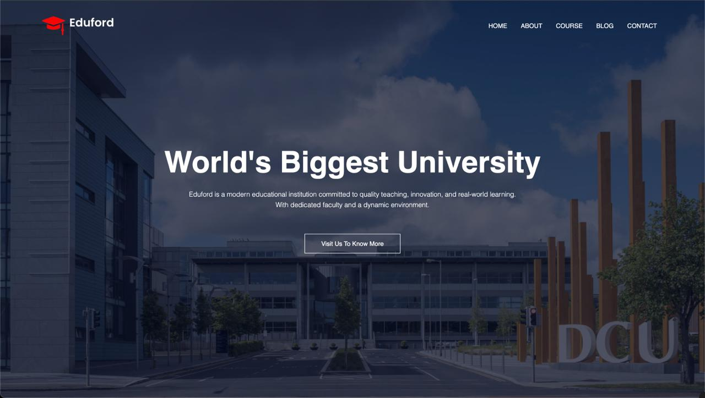

# Eduford — Simple University Landing Site

## Screenshot



A small static website template for a university-style landing site. Includes pages, responsive navigation, a contact form handler (PHP) and all site assets.

Features
- Responsive header with mobile menu controlled by [`showMenu`](main.js) and [`hideMenu`](main.js).
- Multiple pages: Home, About, Courses, Blog, Contact.
- Contact form posts to a PHP handler (requires a PHP-enabled server).
- Simple, modern CSS layout in [`style.css`](style.css).

Quick start

- For static preview (no PHP processing)
  - Open [index.html](index.html) in a browser, or run a static server:
    - VS Code: use Live Server extension.

- To test the contact form (requires PHP)
  - Run PHP built-in server from project root:
    ```sh
    php -S localhost:8000
    ```
